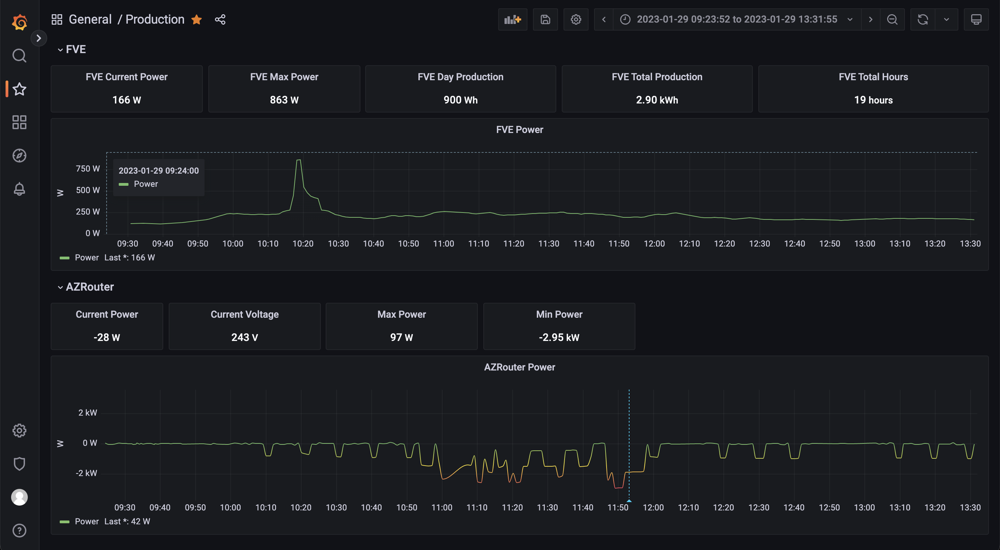
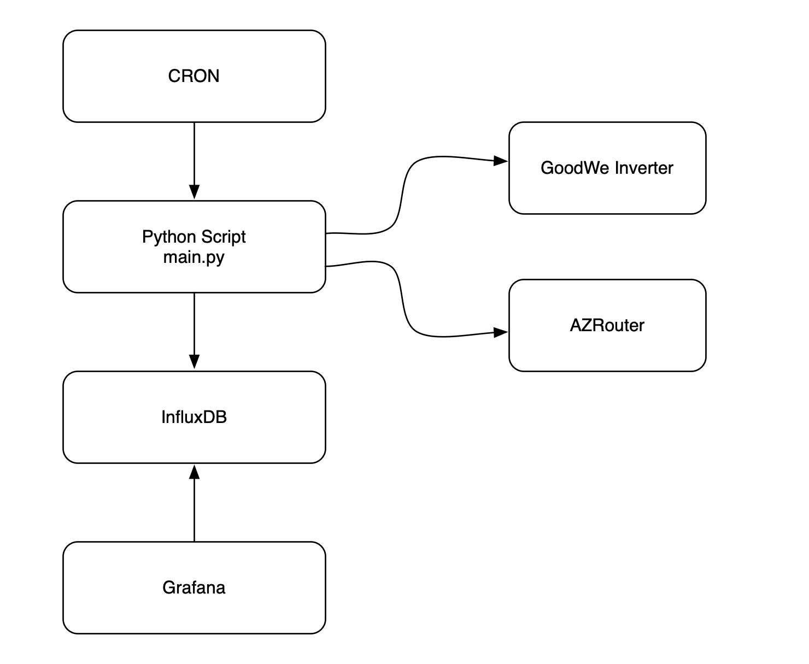

# FVE Charts
Backup of FVE monitoring scripts used in our house. Repository is meant only as backup.

## How It Works

Key ideas:
- Python script takes basic data from GoodWe inverter and AZRouter
- Python script is executed by CRON every minute
- Data are inserted into InfluxDB
- Grafana shows data

## Dependencies and Links

- Python 3.9.6
- [GoodWe python client](https://github.com/marcelblijleven/goodwe)
- [influxdb python client](https://pypi.org/project/influxdb/)
- [InfluxDB](https://portal.influxdata.com/downloads/)
- [Grafana](https://grafana.com)
- [rtl8192eu drivers required for my USB WiFi](https://github.com/Mange/rtl8192eu-linux-driver)

